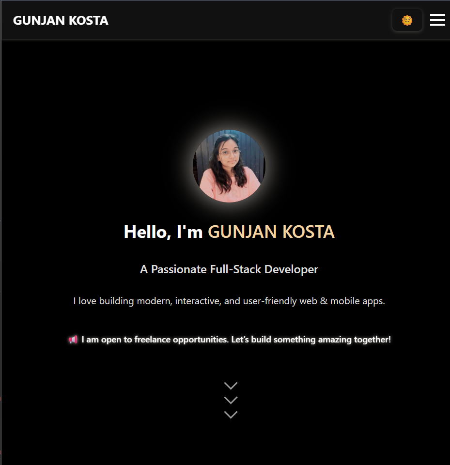
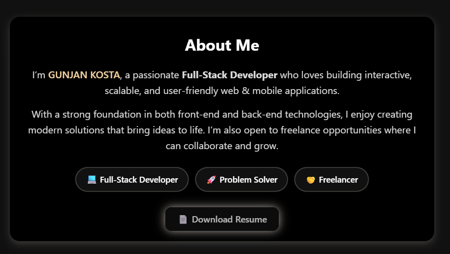
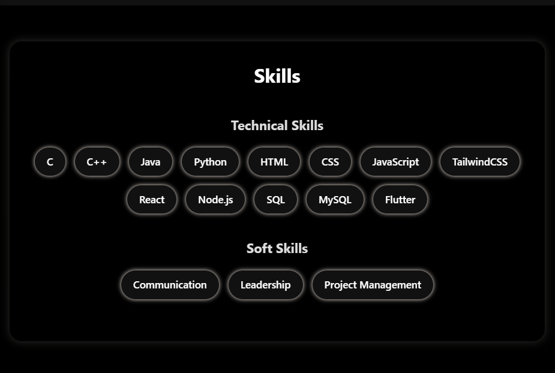
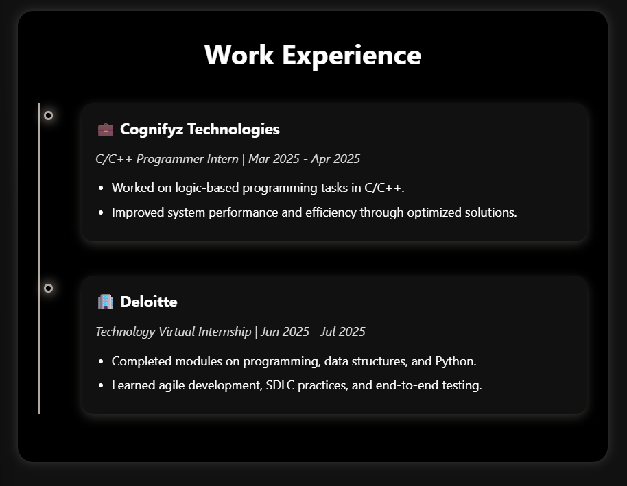
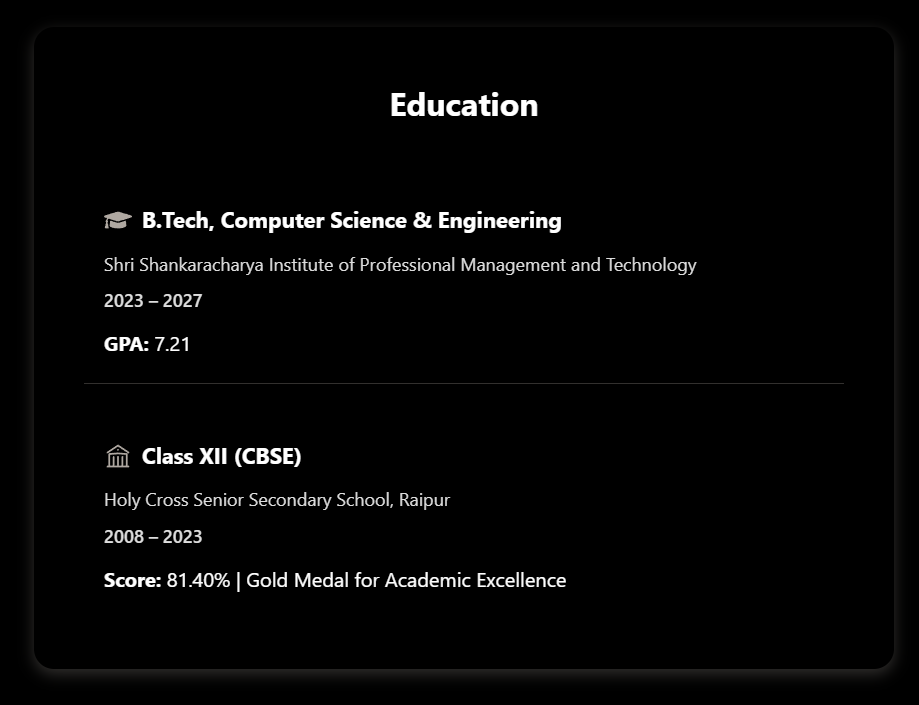
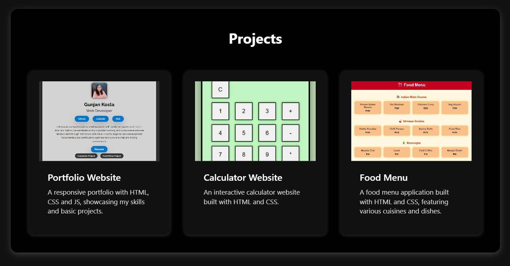
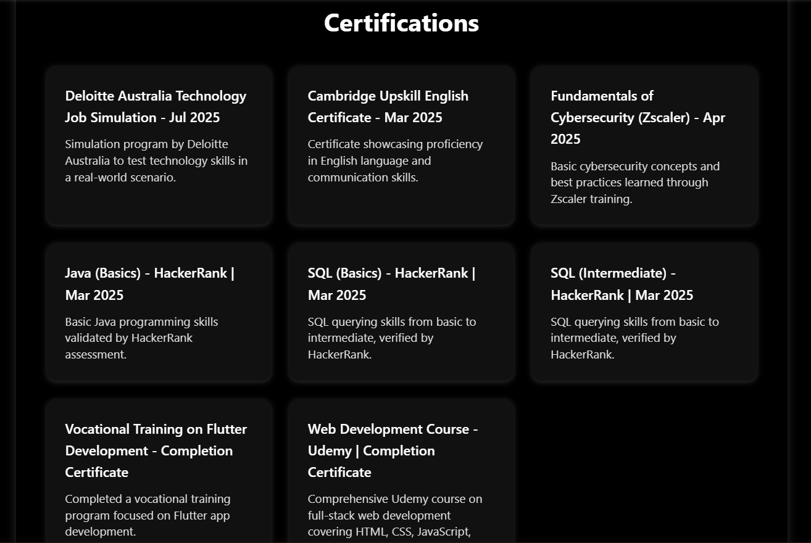
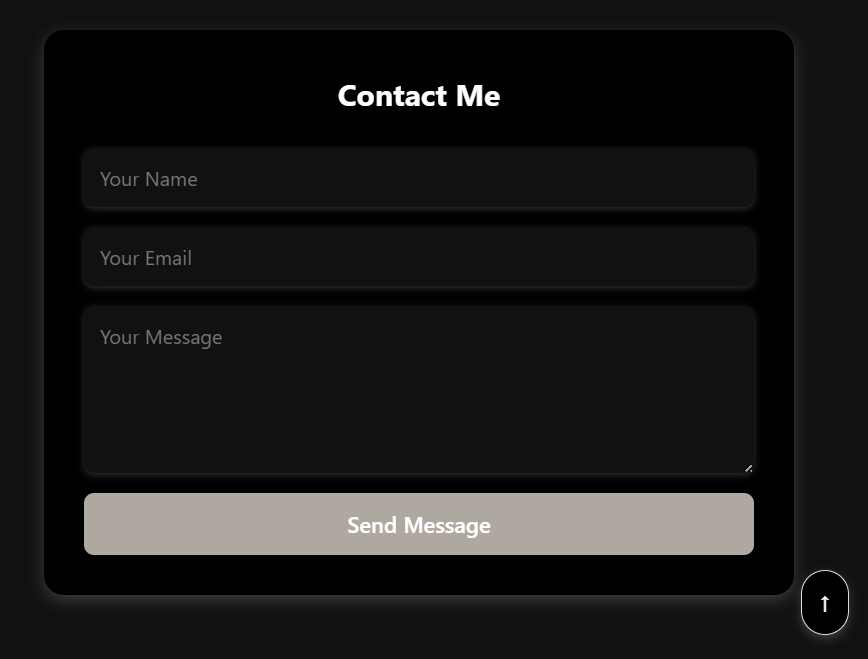
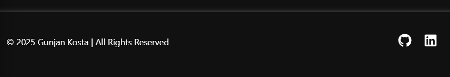

# 🌐 Personal Portfolio Website

This is my **personal portfolio website** built using **React.js** and **Vite** ⚡.  
It highlights my **projects, skills, education, certifications, and work experience**, while also providing an easy way to contact me.

The design is **simple, professional, responsive**, and supports **light/dark themes**.

---

## 🚀 Features

- 🎨 **Light & Dark Theme Support** (CSS variables)
- 🏠 **Home Section** with an introduction
- 📚 **Education & Experience Sections** in clean cards
- 💼 **Projects Section** with clickable cards & thumbnails
- 📜 **Certifications Section** with expandable certificate previews
- 🛠 **Skills Section** with categorized tech stack
- ✉️ **Contact Form** with direct email integration
- ⬆️ **Back to Top Button** for smooth navigation
- 📱 **Responsive UI** for desktop, tablet, and mobile

---

## 🛠️ Tech Stack

- **Frontend:** React.js (with Vite)
- **Styling:** CSS (custom themes, card layout)
- **Email Service:** EmailJS
- **Deployment:** GitHub Pages

---

## 📂 Project Structure

portfolio/
├── public/ # Images, certificates, etc.
├── src/
│ ├── assets/
│ ├── components/ # Website sections
│ │ ├── About.jsx
│ │ ├── Certifications.jsx
│ │ ├── Contact.jsx
│ │ ├── Education.jsx
│ │ ├── Experience.jsx
│ │ ├── Footer.jsx
│ │ ├── Home.jsx
│ │ ├── Navbar.jsx
│ │ ├── Projects.jsx
│ │ ├── Skills.jsx
│ ├── App.css
│ ├── App.jsx
│ ├── index.css
│ ├── main.jsx
├── .gitignore
├── eslint.config.js
├── index.html
├── package.json
├── package-lock.json
├── vite.config.js
└── README.md

---

## ⚙️ Installation & Setup

1. Clone the repository
   ```bash
   git clone https://gunjan-kosta.github.io/my-portfolio/
   cd portfolio
   ```
2. npm install
3. npm run dev

📸 Screenshots










📬 Contact

📧 You can reach me directly via the Contact Form on the website
or at gunjan.kosta2023@gmail.com

📄 License

This project is licensed under the MIT License.

Made with ❤️ by Gunjan Kosta
